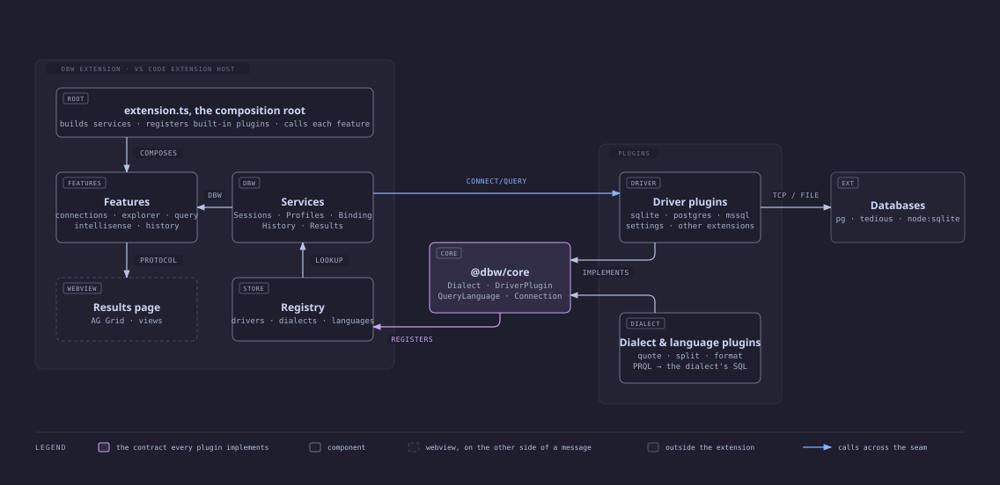

# Working on dbw

This is for people changing dbw or adding a database to it. If you only
want to use it, the [README](README.md) is enough.

## How it is put together



Everything a database or a dialect has to say is said through `@dbw/core`,
the one seam. On its left, the extension: a composition root that builds
the shared services and calls each feature; a registry that looks drivers
and dialects up by id; the results page in a webview on the other side of a
message. On its right, the plugins that implement the contract, and beyond
them the databases they reach. Adding a database or a dialect touches
nothing on the left.

## Add a database

A driver is a package whose default export is a `DriverPlugin` from
`@dbw/core`: an id, a name, a dialect, a JSON Schema for its connection
form, and `connect`, which returns a `Connection` that can `query`, list
`roots` and `children` for the explorer, list `objects` for completion, and
`close`. The built-in drivers in `packages/driver-*` are the reference; the
MariaDB one is the shortest complete example.

### Walkthrough: DuckDB

1. **Create the package.** Copy `packages/driver-mariadb` to
   `packages/driver-duckdb`, then in its `package.json` set the name to
   `@dbw/driver-duckdb` and replace the `mariadb` dependency with
   `@duckdb/node-api`. The workspace glob picks it up; `npm install` links it.

2. **Describe the dialect.** DuckDB speaks PostgreSQL-flavoured SQL:

   ```ts
   export const dialect = defineDialect({
     id: 'duckdb', name: 'DuckDB',
     formatter: 'duckdb',      // a sql-formatter language
     splitter: 'postgres',     // a dbgate-query-splitter flavour
     quote: 'double', limit: 'limit',
     keywords: ['PIVOT', 'UNPIVOT', 'QUALIFY', 'EXCLUDE', 'REPLACE', 'SAMPLE'],
     functions: ['READ_CSV', 'READ_PARQUET', 'LIST_AGGREGATE', 'STRUCT_PACK'],
   });
   ```

3. **Describe the connection form.** DuckDB is a file, so the schema is one
   property: `file` with `format: 'file'`, and `:memory:` as the description
   (see the SQLite driver). Anything with `format: 'password'` goes to VS
   Code's secret storage instead of settings.

4. **Implement `connect`.** Open the database and return the `Connection`:
   `query` runs the text and maps each result to `{ columns, rows, affected,
   durationMs }` with rows as arrays; `roots` lists schemas from
   `information_schema.schemata`; `children` expands a schema into Tables and
   Views folders, a folder into tables, a table into columns; `objects`
   returns every table with its columns for completion. The information
   schema queries in the Postgres driver work on DuckDB almost unchanged.

5. **Test it.** DuckDB runs in-process, so a test like the SQLite one needs
   no server: open `:memory:`, create a table, query it, walk the tree.

6. **Register it.** Four lines in three files: import it in
   `packages/extension/src/extension.ts` and add it to the built-in list,
   add `"@dbw/driver-duckdb": "*"` to `packages/extension/package.json`, and
   add its `package.json` to the `COPY` lines in the `Dockerfile` so the
   Docker gate can install it. Version bumps find it on their own.

7. **Native modules.** `@duckdb/node-api` ships a native binary, and esbuild
   cannot bundle those. Either mark the package `external` in
   `packages/extension/esbuild.mjs` and ship it unbundled, or keep the driver
   out of the extension and load it from settings (below). The built-in
   drivers are pure JavaScript for this reason.

### Other ways to register a driver

- **From settings**, no extension needed: build the module and add its path
  to `dbw.driverModules`.
- **From another extension**: `vscode.extensions.getExtension('sajonaro.dbw-workbench').exports.registerDriver(plugin)`.

A dialect alone (quoting, keywords, formatter, splitter) is registered the
same way with `registerDialect`; a generic driver can let each connection
pick a dialect by putting `dialect` in its connection schema. A query
language that compiles to SQL, as PRQL does, is a `QueryLanguage` registered
with `registerLanguage`: an id (the VS Code language id), `compile(text,
dialect)`, and optionally `split`, `format` and keywords.

## Develop

```sh
npm install
npm run build        # bundles the extension and the results page
npm test             # the analyzer, the dialect helpers, serialization, the sqlite driver
                     # DBW_MARIADB=host:port:user:password also runs the MariaDB driver against a server
npm run check        # activates the bundle in Node with a stubbed vscode: commands, API, deactivation
npm run package      # dbw-workbench-<version>.vsix
npm run vsix         # the same, through the Docker gate, into out/
npm run version      # what every manifest says; `-- 0.2.0` or `-- minor` sets them
```

Press F5 in VS Code with `packages/extension` open to run it in an
Extension Development Host. See [ARCHITECTURE.md](ARCHITECTURE.md) for the
parts in detail and where to add things.

## Release

The `Dockerfile` is the CI: `test` is the gate (types, tests, bundle) and
`dist` is the `.vsix`, which only exists if the gate passed. Three workflows:

- **CI** runs the gate on every push and pull request and uploads the `.vsix`.
- **Tag a release** (run it from the Actions tab, give it `0.2.0`, `minor`
  or `patch`) bumps every manifest, commits, and pushes tag `v<version>`.
- **Release** runs on that tag: the gate again, a GitHub release with the
  `.vsix`, and publication to the VS Code Marketplace and Open VSX when the
  `VSCE_PAT` and `OVSX_PAT` secrets are set. Without them the release still
  happens on GitHub only.

Publishing to the Marketplace is currently done by hand: download the
`.vsix` from the GitHub release and upload it under the `sajonaro` publisher
at marketplace.visualstudio.com/manage. Setting a `VSCE_PAT` secret with the
*Marketplace: Manage* scope would make the Release workflow do it instead.
